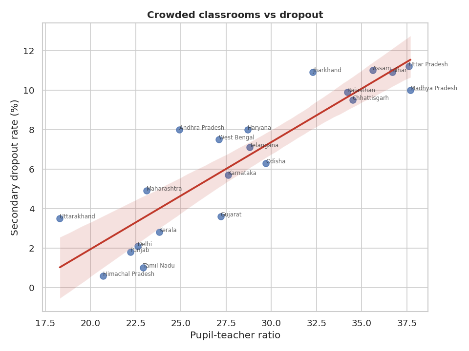
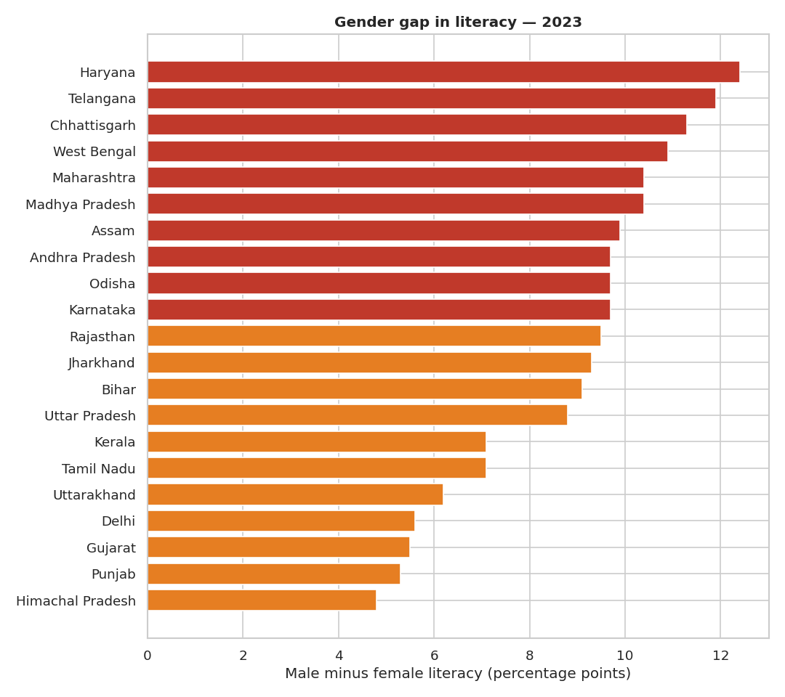

# India Education & Literacy Gap Analysis 📚🇮🇳

A data-analysis project examining literacy, gender gaps, and school dropout across Indian states — framed around **UN Sustainable Development Goal 4: Quality Education**.

The goal is simple: turn public education data into a picture a policymaker (or a curious citizen) can act on. Which states are pulling ahead? Where is the gender gap widest? And is there anything a state can *do* about dropout?

> ⚠️ **About the data:** the CSV in `data/` is **synthetic sample data** so the code runs immediately. It is *not* official. To publish real findings, swap in data from the sources listed below and re-run. Everything else works unchanged.

---

## What this project shows

- **Data cleaning & validation** — standardising names, dropping impossible values, fixing types
- **Ranking & comparison** — literacy across 21 states
- **Segmentation** — male vs female literacy, and the gap between them
- **Correlation analysis** — does classroom crowding track with dropout?
- **Trend analysis** — literacy trajectories over four census points
- **Communication** — a clean findings summary and four publication-ready charts

---

## Sample findings

*(from the synthetic data — illustrative only)*

- Literacy leaders and laggards differ by nearly **20 percentage points**.
- The **gender gap** is widest in a handful of northern states, exceeding 11 points.
- Pupil-teacher ratio and dropout correlate strongly (**r ≈ 0.89**) — crowded classrooms and dropout travel together, which points at teacher hiring as a lever.




---

## How to run

```bash
# 1. install dependencies
pip install -r requirements.txt

# 2. generate the sample dataset
python src/generate_sample_data.py

# 3. run the analysis (writes charts + findings to outputs/)
python src/analysis.py
```

Or open `notebooks/exploration.ipynb` to step through it interactively.

---

## Project structure

```
india-education-analysis/
├── data/        # dataset (synthetic sample — replace with real data)
├── src/         # data generation + analysis pipeline
├── notebooks/   # interactive exploration
├── outputs/     # generated charts + findings.md
├── requirements.txt
└── README.md
```

---

## Use real data

Replace `data/india_education_sample.csv` with real figures (same column names) from:

- **Census of India** — https://censusindia.gov.in
- **UDISE+** (school-level education stats) — https://udiseplus.gov.in
- **UNESCO Institute for Statistics** — https://uis.unesco.org
- **Periodic Labour Force Survey (PLFS)** — MoSPI

Columns expected: `state, year, literacy_overall, literacy_male, literacy_female, gender_gap, dropout_rate_secondary, pupil_teacher_ratio, gross_enrollment_ratio`.

---

## Roadmap

- [ ] Swap synthetic data for real Census + UDISE+ figures
- [ ] Add district-level drilldown
- [ ] Build a small Streamlit dashboard
- [ ] Add a rural vs urban split

---

## License

MIT — free to use, learn from, and build on.

## Author

Ruchir Ganatra — [portfolio](https://ruchirganatra-github-io.vercel.app) · aspiring data analyst focused on education and social-impact data.
