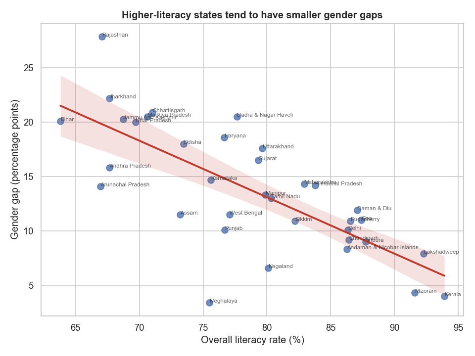
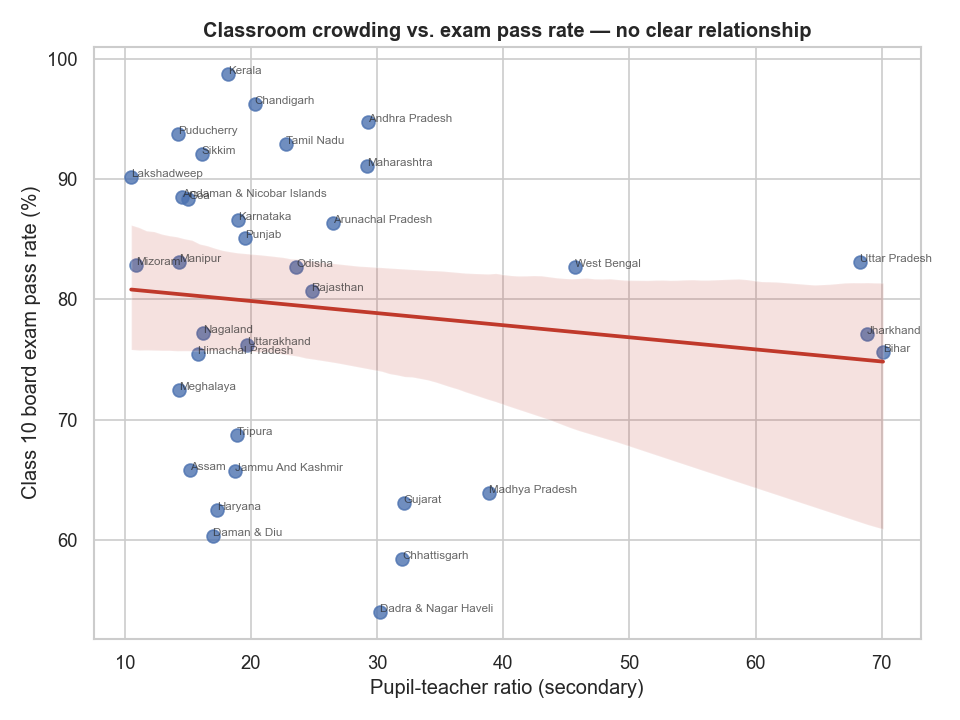

# India Education & Literacy Gap Analysis 📚🇮🇳



A data-analysis project examining literacy and gender gaps across Indian states, using real 2015-16 UDISE administrative data — framed around **UN Sustainable Development Goal 4: Quality Education**.

> **Data:** real UDISE (Ministry of Education) state-level school census, 2015-16, accessed via a public Kaggle mirror. Not synthetic, not a survey estimate. See [`docs/DATA_SOURCES.md`](docs/DATA_SOURCES.md) for the exact source, license, and how every derived number is computed.

---

## What this project shows

- **Data cleaning & validation** — parsing a 630-column raw administrative file down to a clean state-level table, fixing inconsistent state-name formatting
- **Ranking & comparison** — literacy across 35 states/UTs
- **Segmentation** — male vs. female literacy, and the gap between them
- **Correlation analysis, reported honestly** — including a null result (see below)
- **Communication** — a clean findings summary and four publication-ready charts

---

## Key findings

*(2015-16 UDISE state-level data — a single-year snapshot, not a trend; see [`docs/METHODOLOGY.md`](docs/METHODOLOGY.md))*

- Literacy ranges from **63.8% (Bihar) to 93.9% (Kerala)** — a ~30-point spread.
- The **gender gap is widest in Rajasthan (27.9 points)**, followed by Jharkhand and Chhattisgarh.
- **Higher-literacy states have meaningfully smaller gender gaps** (r ≈ -0.74) — literacy gains and gender parity move together in this data.
- **Classroom crowding does *not* clearly track exam outcomes** — pupil-teacher ratio vs. Class 10 pass rate shows only a weak correlation (r ≈ -0.13). Reported as a genuine null result, not dropped or reframed to manufacture a stronger story.




---

## How to run

```bash
# 1. install dependencies
pip install -r requirements.txt

# 2. run the analysis (writes charts + findings to outputs/)
python src/analysis.py

# 3. run the tests
pytest -q
```

Or open `notebooks/exploration.ipynb` to step through it interactively.

---

## Project structure

```
india-education-analysis/
├── data/        # cached real UDISE CSV (see docs/DATA_SOURCES.md)
├── src/
│   ├── data.py       # load + clean the raw UDISE file, derive metrics
│   └── analysis.py   # findings + charts
├── tests/       # pytest suite
├── notebooks/   # interactive exploration
├── outputs/     # generated charts + findings.md
├── docs/
│   ├── DATA_SOURCES.md  # source, license, derived-column formulas
│   └── METHODOLOGY.md   # what this cross-section can and cannot claim
├── requirements.txt
└── README.md
```

---

## Limitations

- **Single-year cross-section (2015-16)** — no trend analysis. An earlier version of this project simulated a multi-year trend from synthetic data; this rebuild deliberately does not repeat that.
- **Telangana is excluded** — its literacy figures are missing in this release (it split from Andhra Pradesh in 2014). Documented, not zero-filled.
- **Delhi's Class 10 pass rate is missing**, not 0% — the source data shows zero students appeared that cycle.
- Full details in [`docs/METHODOLOGY.md`](docs/METHODOLOGY.md).

---

## Roadmap

- [ ] Pull a newer UDISE+ release for a more recent snapshot
- [ ] Add a second year to support an honest trend comparison
- [ ] Add a district-level drilldown
- [ ] Build a small Streamlit dashboard

---

## License

MIT — free to use, learn from, and build on.

## Author

Ruchir Ganatra — [portfolio](https://ruchirganatra-github-io.vercel.app) · aspiring data analyst focused on education and social-impact data.

*Data © Ministry of Education, Government of India (UDISE); accessed via a Kaggle mirror. This project is an independent analysis and is not affiliated with or endorsed by the Ministry of Education or UDISE+.*
